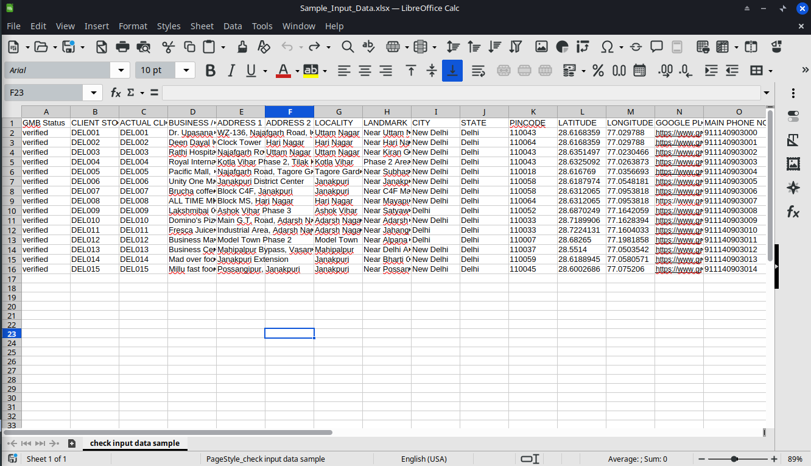
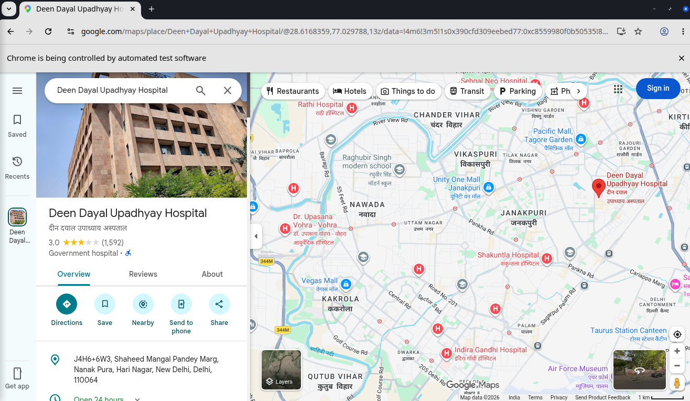
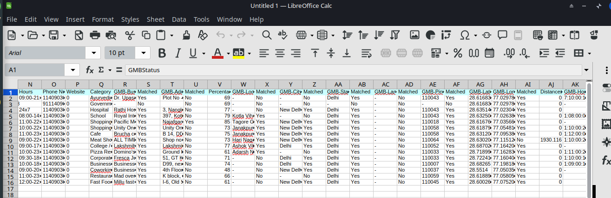

# Google Maps Business Data Match & Validation System

## Overview

Google Maps Business Data Match & Validation System is a Java-based automation solution that validates business records against live Google Maps Business Profile data.

The system automatically extracts business information from Google Maps and compares it with structured input data to identify inconsistencies, missing information, and data quality issues.

---

## Features

* Automated Google Maps Business Profile Validation
* Business Name Matching
* Address Validation
* Latitude & Longitude Verification
* Phone Number Validation
* Website Validation
* Business Hours Verification
* Category Matching
* Ratings & Reviews Extraction
* Services, Amenities & Accessibility Extraction
* Match Percentage Calculation
* Distance-Based Location Validation
* Excel-Based Reporting

---

## Tech Stack

* Java
* Selenium WebDriver
* Apache POI
* TestNG
* Maven
* Jsoup
* Google Maps

---

## Project Structure

google-maps-business-validation-system/
│
├── src/
│   └── main/
│       └── java/
│           └── GMB_Data_Match_AND_Validation_System/
│               │
│               ├── Classes/
│               │   ├── GMB_Matched.java
│               │   └── GMB_Functions.java
│               │
│               ├── Repository/
│               │   └── excelSheetUtility.java
│               │
│               ├── Driver/
│               │   └── SingletonClassChromeNew.java
│               │
│               └── Excel/png
│                   ├── Input_file.xlsx
│                   └── output_file.xlsx
├── screenshots/
│   ├── input-sheet.png
│   ├── google-maps-validation.png
│   └── output-report.png
│
├── pom.xml
├── testng.xml
├── README.md
└── .gitignore

### Directory Description

| Directory/File                 | Purpose                                                                               |
| ------------------------------ | ------------------------------------------------------------------------------------- |
| `GMB_Matched.java`             | Main automation execution class responsible for data extraction and validation        |
| `GMB_Functions.java`           | Contains helper methods, matching logic, distance calculations, and utility functions |
| `excelSheetUtility.java`       | Handles Excel input/output operations using Apache POI                                |
| `SingletonClassChromeNew.java` | Initializes and manages Selenium WebDriver instances                                  |
| `Input_file.xlsx`              | Contains business records used for validation                                         |
| `testng.xml`                   | TestNG configuration file                                                             |
| `pom.xml`                      | Maven dependency and build configuration                                              |
| `screenshots/`                 | Project screenshots used in README                                                    |

---

## System Architecture

Input Excel
      ↓
Apache POI
      ↓
TestNG Execution
      ↓
Selenium WebDriver
      ↓
Google Maps Business Profile
      ↓
Data Extraction
      ↓
Matching & Validation Engine
      ↓
Excel Report Generation

---

## Project Workflow

1. User provides business records through an Excel input file.
2. Automation opens Google Maps business profile URLs.
3. Business information is extracted automatically.
4. Extracted data is compared against input records.
5. Match percentages and validation results are generated.
6. Final validation report is exported to Excel.

---

## Input File

The input sheet contains:

* Business Name
* Address
* Locality
* City
* State
* Pincode
* Latitude
* Longitude
* Phone Number
* Website
* Business Hours
* Category

### Sample Input

---

## Validation Process

The automation opens Google Maps listings and validates business information against the provided records.

---

## Output Report

The generated report contains:

* Business Name Match
* Address Match
* Locality Match
* City Match
* State Match
* Phone Match
* Website Match
* Category Match
* Latitude/Longitude Match
* Distance Validation
* Ratings & Reviews
* Services & Amenities
* Images Count

---

## How To Run

### Prerequisites

* Java 8+
* Eclipse IDE
* Google Chrome
* ChromeDriver

### Steps

1. Open the project in Eclipse IDE.
2. Update the input Excel file.
3. Configure the output file path in `excelSheetUtility.java`.
4. Open `GMB_Matched.java`.
5. Right-click on `GMB_Matched.java`.
6. Select:

Run As → TestNG Test

7. Wait for execution to complete.
8. Review the generated Excel output report.

---

## Notes

* Sample input data is provided for demonstration purposes.
* The public version does not include CAPTCHA-solving services.
* If Google displays a CAPTCHA challenge, solve it manually and continue execution.
* Do not use confidential client data in public repositories.

---

## Future Enhancements

* Multi-threaded Processing
* Dashboard Integration
* Cloud Deployment
* Automated Report Delivery
* Advanced Similarity Scoring

---

## Author

Deepak Nai

GitHub: https://github.com/Deepusain
